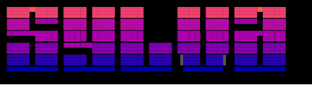
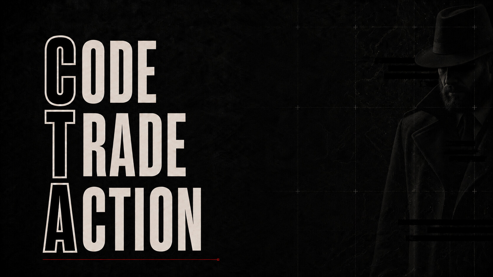

  

  

<h2 align="center">Founder &amp; Developer</h2>

## Le Мasterpiece

  

<table>
  <tr>
    <td width="50%" valign="top">
      <h3><a href="https://github.com/therealsylva/anyapi">AnyAPI</a></h3>
      
Turns cURL, OpenAPI, Swagger, or Postman definitions into native command-line applications. Local-first, deterministic, and usable without a hosted runtime.

      Go · Developer tooling · CLI
    </td>
    <td width="50%" valign="top">
      <h3><a href="https://github.com/therealsylva/Kovert">Kovert</a></h3>
      
A programmable Linux host-security daemon that reacts to filesystem, network, USB, process, service, and emergency-key events through controlled defensive policies.

      Rust · Linux · Host security
    </td>
  </tr>
  <tr>
    <td width="50%" valign="top">
      <h3><a href="https://github.com/therealsylva/Qshard">Qshard</a></h3>
      
Offline cryptographic core and complete client stack for Qchain. Credentials are encrypted, divided with 3-of-5 Shamir secret sharing, and distributed across ten independent storage nodes.

      Rust · Cryptography · Distributed systems
    </td>
    <td width="50%" valign="top">
      <h3><a href="https://github.com/therealsylva/HailMary">HailMary</a></h3>
      
Offline-first remote systems management for authorised air-gapped networks using encrypted, signed task and result bundles with no inbound remote sessions.

      Rust · Air-gapped systems · Secure operations
    </td>
  </tr>
</table>

 

  

